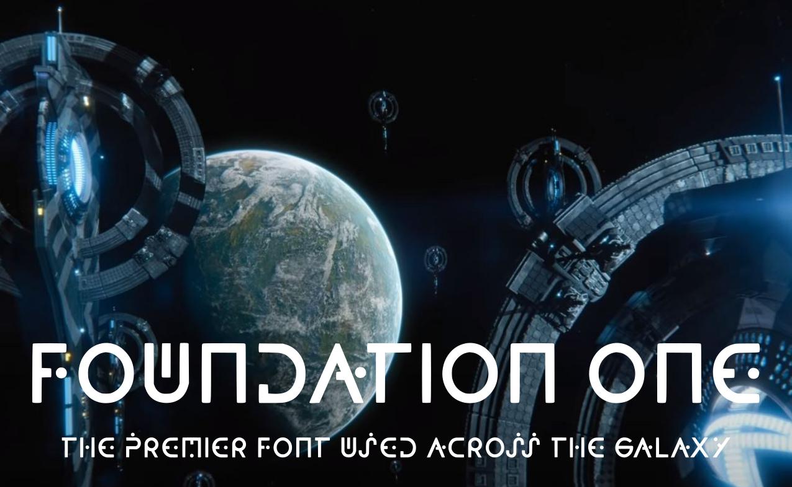
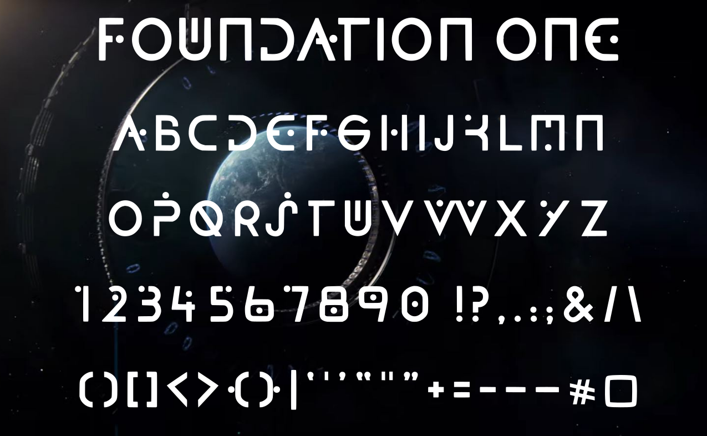

# Foundation One

Based on the central font design used in Foundation, the Apple TV+ series based on the Asimov books, to indicate a change in context, location or time.  Released with the Open Font License (OFL).

The font is still under construction and not all the characters and numbers (and hardly any symbols or punctuation) have shown up.  Here the "missing" glyphs are substituted with  &#8220;compatible conjectures&#8221;:

<!-- img src="samples/Foundation_One_conjectured_characters.png" alt="The text 'Quizzical twins proved my hijack bugfix' plus numbers, basic symbols and punctuation, set in the Foundation One font, based on the Apple TV+ series Foundation" title="Characters already completed in the Foundation One font" / -->

As you can see, the font features distinctive S, M, U, W, B, K and G shapes not shared with other typefaces.  Many characters and all the numbers include dots in the design (H, 1, 3) or as a decorative element (A, S, W). 

To download the related OFL font based on Foundation&rsquo;s title sequence, visit the <a href="https://github.com/rsperberg/foundation-titles-hand" title="Jump to Foundation Titles repo">Foundation Titles</a> repo here on Github.
