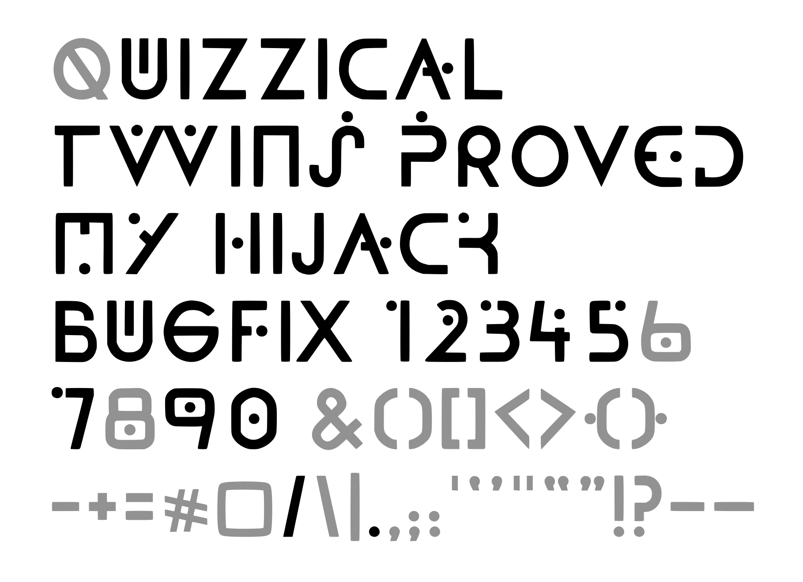

# Foundation One

The font design used in Foundation, the Apple TV+ series, to indicate a change in location or time. Released with the Open Font License (OFL).

The font is still under construction and not all the characters and numbers (and hardly any symbols or punctuation) have shown up. Here is everything so far (in black), filled in with &#8220;compatible conjectures&#8221; (in gray) for what&rsquo;s missing:

To download the related OFL font based on Foundation&rsquo;s title sequence, visit the <a href="https://github.com/rsperberg/foundation-titles-hand" title="Jump to Foundation Titles repo">Foundation Titles</a> repo here on Github.
