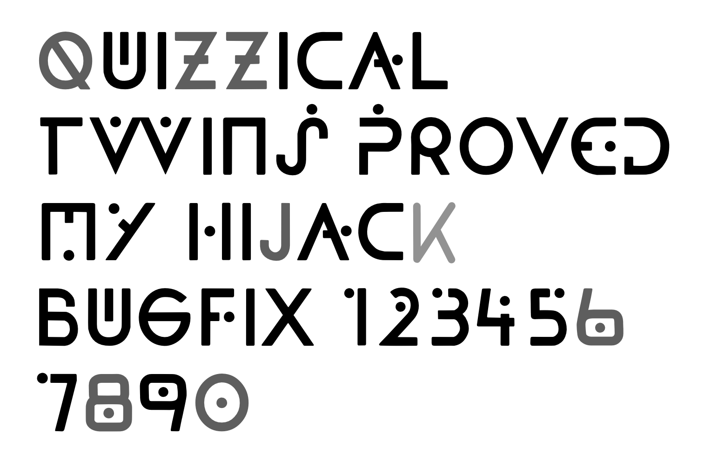

# Foundation One 

The font design used in Foundation, the Apple TV+ series, to indicate a change in location or time. Released with the Open Font License (OFL).

The font is still under construction and is not yet available to use. Here are characters that have been built so far (in black; gray are &#8220;compatible conjectures&#8221; until they show up in the series):

To download the related OFL font based on Foundation&rsquo;s title sequence, visit the <a href="https://github.com/rsperberg/foundation-titles-hand" title="Jump to Foundation Titles repo">Foundation Titles</a> repo here on Github.

