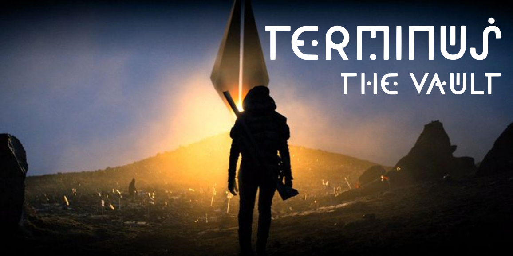

# About This Font

The Apple TV+ series Foundation uses related designs for the text used in the logo, in the title sequence, to indicate changes in location or time, for the signage on space ships, for the text displayed on a screen (or projected holographically).

Foundation One is taken from the design most people would associate with the show. It is used with text superimposed on the visuals, almost always to indicate a new location (e.g., "SYNNAX") or a change in the time frame, for example, "400 YEARS EARLIER," and "17 YEARS AFTER THE STARBRIDGE BOMBING." Because the thirteen cloned emperors (and the emperor to be) are his exact lookalikes, a flashback to the first in the line was labeled "CLEON THE FIRST," and a cut to the heir "CLEON THE 14TH."  

There is not much need for symbols and punctuation in these labels, and not every character or number has been used in the half-season seen so far.  And, of course, no lowercase characters are used. Consequently in the font being produced in this project, the Q, Z, 6 and 8 are conjectures, there are no lowercase letters, and all the symbols and marks of punctuation other than the period and virgule are sheer invention.  Nonetheless, to make the font useful for general purposes, most of the Unicode Basic Latin codeblock is included currently.

